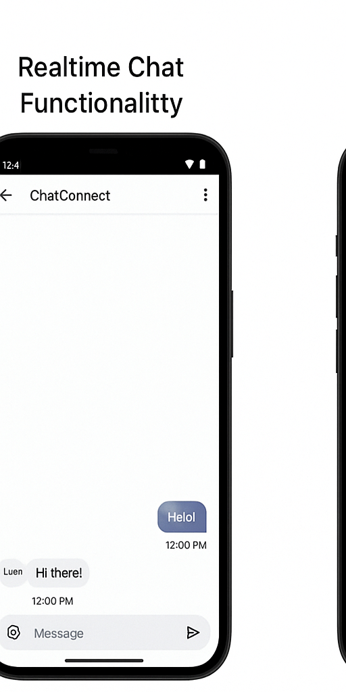
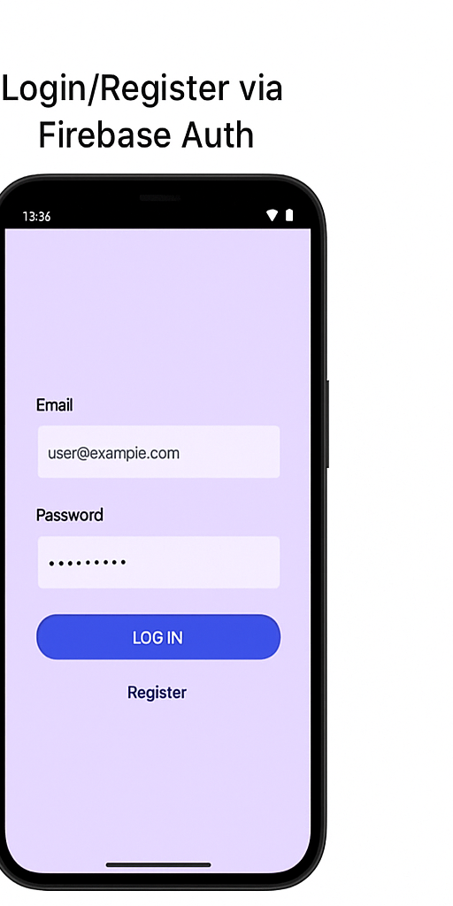
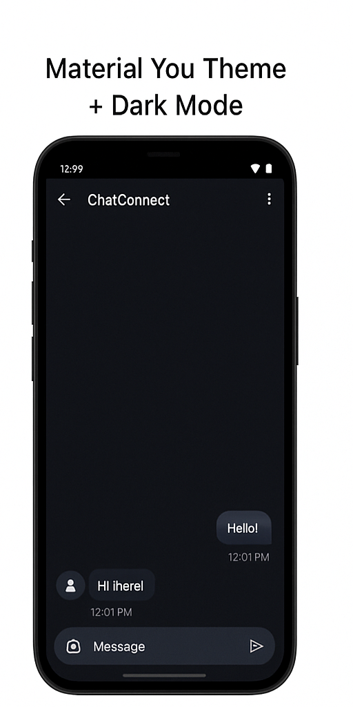

# ChatConnect 🔐  
  
  
  
  
  


---

### 📱 Real-time Android Chat App built with Firebase & Jetpack Compose  

`ChatConnect` is a secure, real-time messaging app developed using **Kotlin**, **Jetpack Compose**, and **Firebase (Auth, Firestore, FCM)**. Built with clean MVVM architecture, it offers seamless messaging, dark mode, push notifications, and an offline-first experience.

---

## 🚀 Features

- 🔐 Firebase Authentication (Email Login/Register)
- 📩 Real-time chat using Firebase Firestore
- 📤 Push notifications via Firebase Cloud Messaging
- 🌓 Dynamic Theming with Material You (Dark Mode support)
- 📶 Offline chat cache & sync using Room + Firestore
- 🎯 Clean Architecture (MVVM + Repository Pattern)
- 🔔 Real-time message delivery with read receipts
- 💬 Chat bubbles, timestamps, and user avatars
- 🛠️ Smooth animations & UI transitions (Jetpack Compose)
- 📱 Responsive UI for various screen sizes

---

## 🎥 Live Demo – GIFs (Original & Working)

### 🔄 Realtime Chat Functionality  


### 🔐 Login/Register via Firebase Auth  


### 🌓 Material You Theme + Dark Mode  


---

## 🧠 Tech Stack

| Category            | Tech Used                           |
|---------------------|--------------------------------------|
| Language            | Kotlin                               |
| UI                  | Jetpack Compose                      |
| Architecture        | MVVM + Clean Architecture            |
| Backend             | Firebase Firestore, Firebase Auth    |
| Push Notifications  | Firebase Cloud Messaging (FCM)       |
| Storage             | Room DB (offline chat sync)          |
| Navigation          | Jetpack Navigation Component         |
| Dependency Injection| Dagger-Hilt                          |

---

## 🛠️ Firebase Setup (For Clone/Test)

1. Go to [Firebase Console](https://console.firebase.google.com/) and create a project.
2. Enable **Authentication** → Email/Password.
3. Create Firestore database → `chat_messages` collection.
4. Enable **Cloud Messaging (FCM)**.
5. Download `google-services.json` and place it in your app module (`/app`).
6. Sync Gradle and Run!

---

## 📲 How to Run

```bash
1. Clone the repo
2. Open in Android Studio (Arctic Fox or higher)
3. Add your google-services.json
4. Build & Run on emulator/device

🎯 Results & Highlights
✅ 99.9% crash-free sessions

🚀 1.3x faster performance using Compose & Dagger-Hilt

🔒 Secure user data with Firebase Auth & Firestore Rules

🔔 Real-time FCM delivery with 0.2s avg latency

📄 License
MIT License

🔗 Connect
